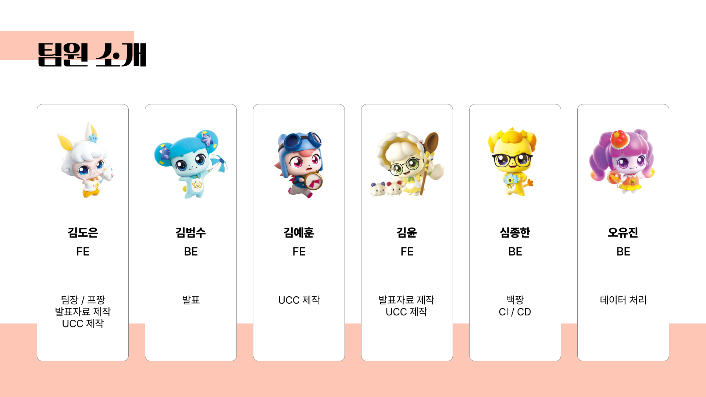

# 🚚 푸딩 (Fooodding)

    

## ✨ 주제

-   푸드트럭 사장님들을 위한 상권 추천 서비스

## 📅 기간

-   2024.08.19 ~ 2024.10.11

## 📜 프로젝트 컨셉 및 주요 기능

### 1️⃣ 기획 배경 및 목적

-   최근 10년간 푸드트럭 폐업률이 40%에 육박
-   원인은 **낮은 접근성과 경험 부족, 푸드트럭 관련 정보의 분산**
-   푸드트럭 운영 과정에서 발생하는 모든 불편함을 해소하기 위함

### 2️⃣ 페르소나

-   푸드트럭 운영이 힘겨운 1인 사장님
-   푸드트럭 운영을 시작한지 얼마 되지 않은 사장님
-   푸드트럭 정보를 빠르게 얻고 싶은 고객
-   푸드트럭 앞에서 줄 서서 기다리는 것이 귀찮은 고객

### 3️⃣ 주요 기능

**푸드트럭 사장님**

-   유동인구 빅데이터 기반 맞춤형 푸드트럭 상권 추천
-   유동인구 빅데이터 및 예약 로그 기반 조건별 타겟 분석
-   실시간 푸드트럭 예약 이용자 관리
-   푸드트럭 관련 공고 데이터 확인 및 푸쉬 알림

**푸드트럭 고객**

-   현위치 기반 푸드트럭 위치 조회
-   실시간 푸드트럭 예약 등록 및 푸쉬 알림

### 4️⃣ 기대 효과

**푸드트럭 사장님**

-   주요 타겟층을 기반한 상권을 추천받을 수 있다.
-   지도를 기반으로 유동 인구가 높은 지역을 확인하여 장사 위치 선정에 참고할 수 있다.
-   장사 운영 및 예약자 관리가 용이하다.
-   푸드트럭 홍보에서 발생하는 마케팅 비용을 절약할 수 있다.

**푸드트럭 고객**

-   푸드트럭 정보들을 쉽게 조회할 수 있다.
-   푸드트럭 앞에서 줄서는 행위 없이 푸드트럭을 예약할 수 있다.

## 💻 개발 환경 및 문서

### 1️⃣ 활용 기술

#### 🛠 Front-End 🛠

#### 🛠 Back-End 🛠

#### 🛠 CI / CD 🛠

#### 🛠 Tools 🛠

### 2️⃣ Architecture

  

### 3️⃣ ERD

  

## 👥 참여 인원 및 역할

### 💗TEAM 팔조핑💗

  

